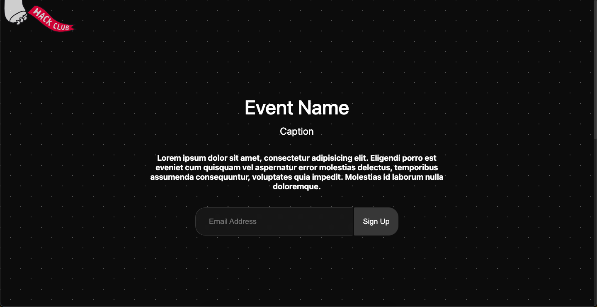
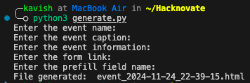

# A really simple template for a website for a hackathon

maybe use the `generate.py`, idk. or else, just have a look at the `index.html` file and edit it to your liking. 

the python script will generate an html file with the name of the hackathon, caption, some other information like venue etc., link to form, and the field to prefill with the email address entered.

